# СОВРЕМЕННОЕ ПРОГРАММИРОВАНИЕ
                     
## Лабораторная работа №3

## «Взаимодействие с пользователем»

1.	Разработано приложение DroidCafe: 

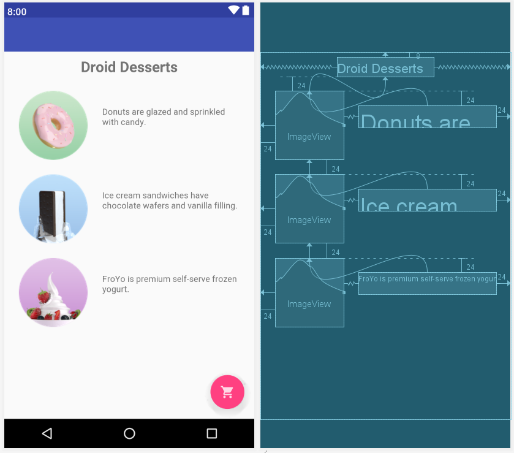

Рисунок 1 – Отображение дизайна при горизонтальной ориентации экрана

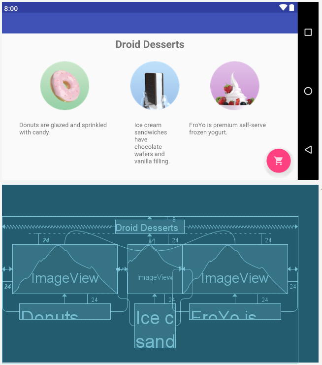

Рисунок 2 – Отображение дизайна при вертикальной ориентации экрана

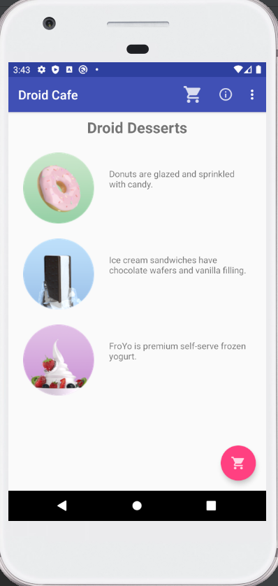

Рисунок 3 – Отображение на устройстве с горизонтальной ориентацией экрана

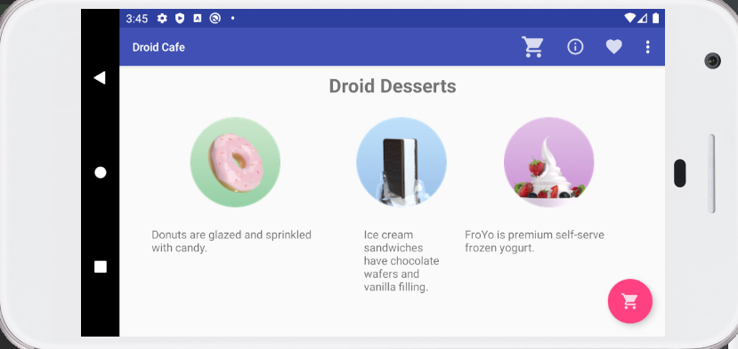

Рисунок 4 – Отображение на устройстве с вертикальной ориентацией экрана

2.	Создайте приложение с 5 checkboxes и кнопкой «Show Toast»:

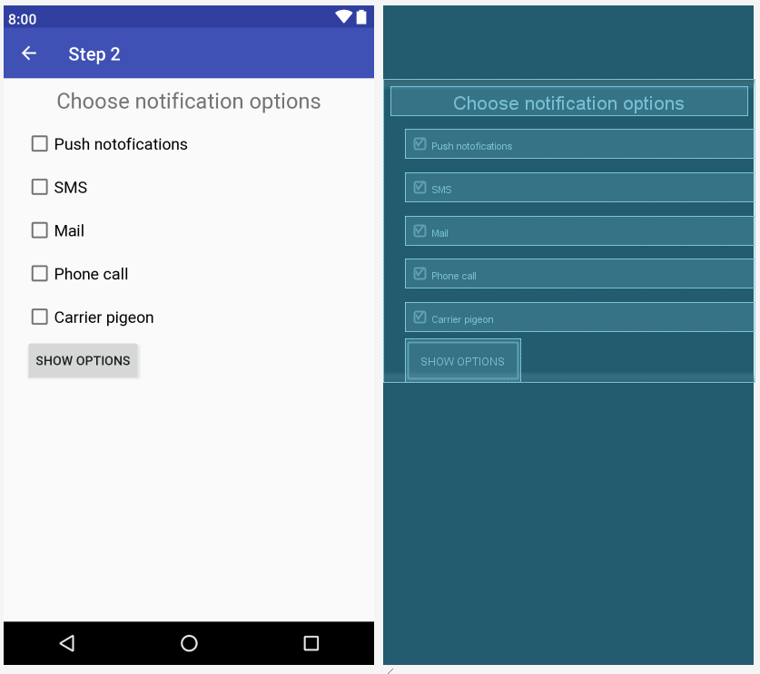

Рисунок 5 – Отображение дизайна

На активности представленно несколько чекбоксов с различными параметрами, при выборе чекбокса его описание будет выведено после нажатия кнопки ***SHOW OPTIONS*** вместе со всеми выбранными пунктами.

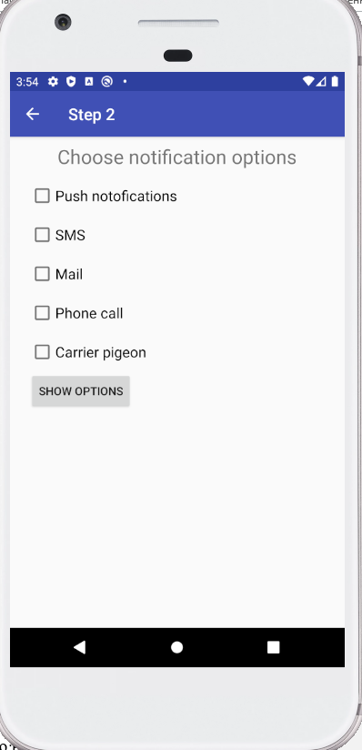

Рисунок 6 – Активность с чекбоксами

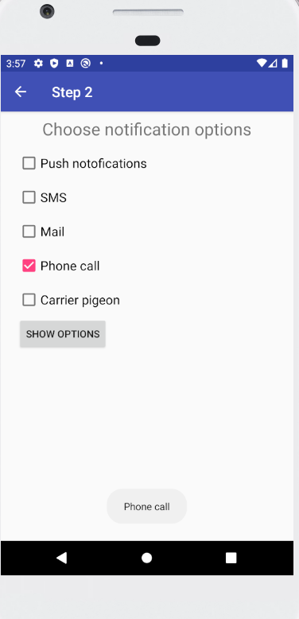

Рисунок 7 – демонстрация активности с одним чекбоксом

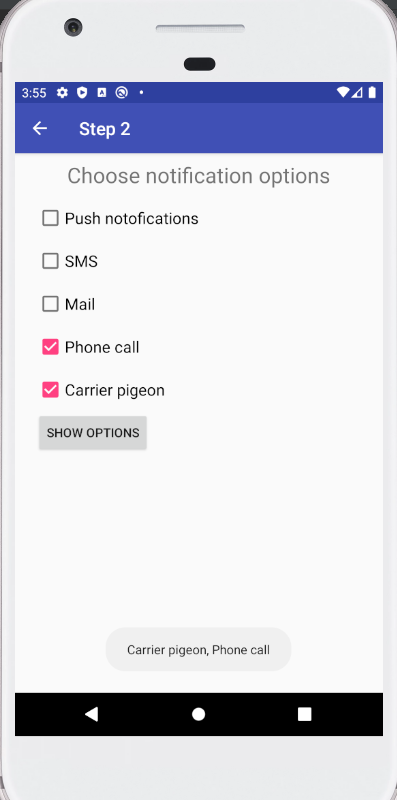

Рисунок 8 – демонстрация активности с несколькими чекбоксами

3.	Доработайте приложение DroidCafeOptions: добавьте кнопку «Дата» под вариантами доставки, которая показывает выбор даты; добавьте выбранную пользователем дату во всплывающем сообщении

Пра нажатии кнопки ***CHOOSE DELIVERY DATE*** появится окно с календарем. После выбора и подтверждения дата будет выведена на экран. 

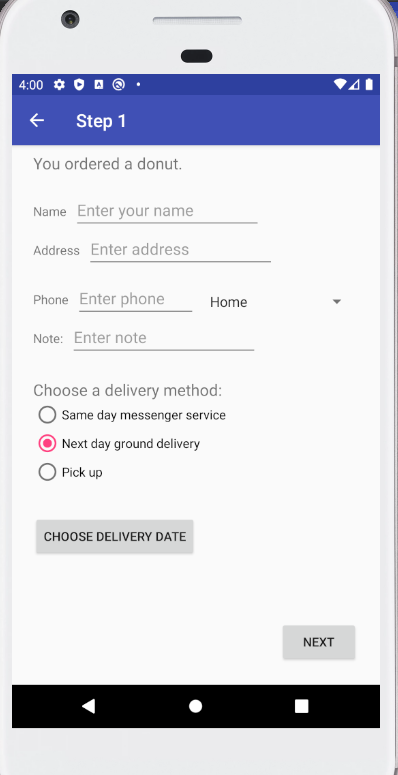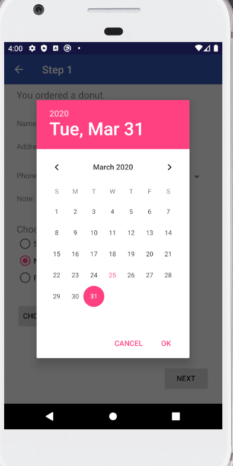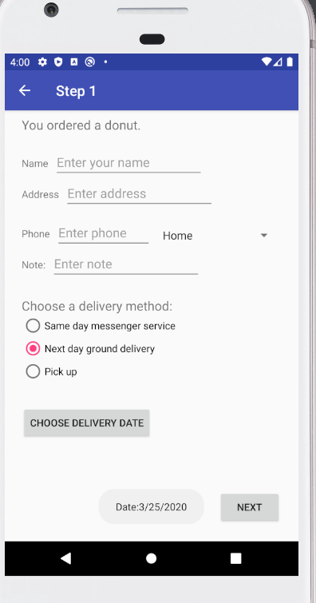

Рисунок 9 – демонстрация работы с датой

4	Создайте приложение с главной «Activity»  и, по крайней мере, тремя другими дочерними «Activity». Каждое «Activity» должно иметь меню параметров и использовать панель инструментов:
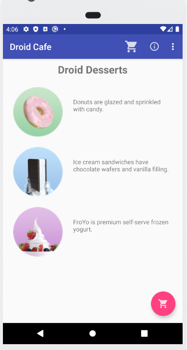
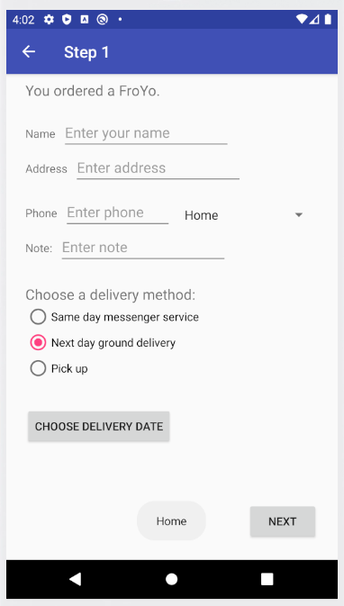
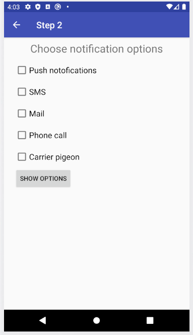
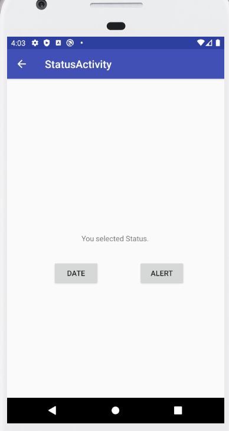

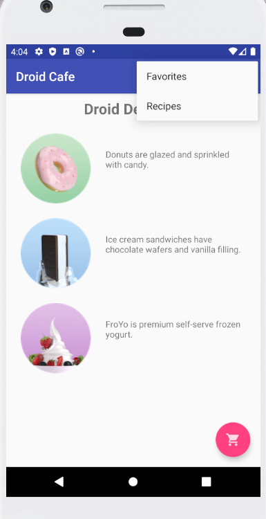
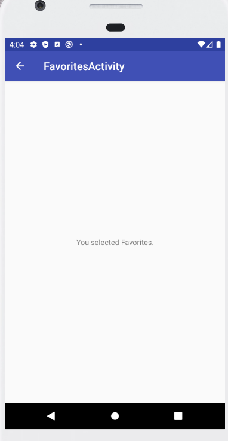
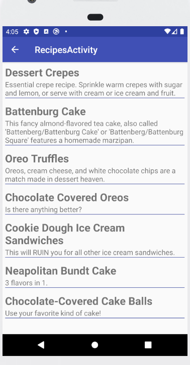
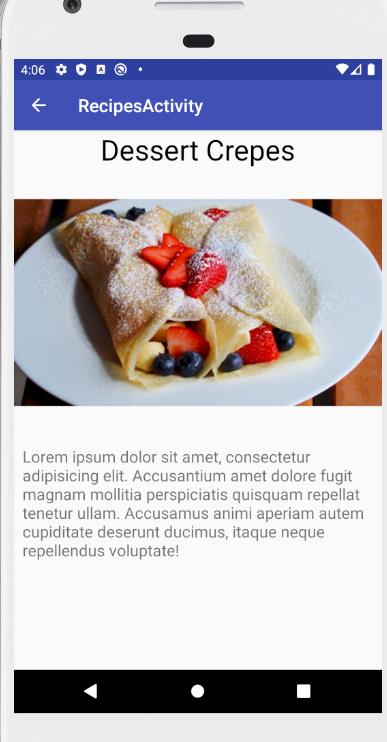

5.	Создайте приложение, которое использует RecyclerView для отображения списка рецептов. Каждый элемент списка должен содержать название рецепта с кратким описанием. Когда пользователь нажимает на рецепт (элемент в списке), запускается «Activity», которая показывает полный текст рецепта.


6.	Используйте отдельные элементы TextView и стили для названия и описания рецепта. Вы можете использовать заполнитель текста для полных рецептов. Как вариант, добавьте изображение готового блюда к каждому рецепту. При нажатии кнопки «Вверх» пользователь возвращается к списку рецептов.

Листинг recipe_item.xml

```dtd
<?xml version="1.0" encoding="utf-8"?>
<LinearLayout xmlns:android="http://schemas.android.com/apk/res/android"
    android:layout_width="match_parent"
    android:layout_height="wrap_content"
    android:orientation="vertical"
    android:padding="6dp">

    <TextView
        android:id="@+id/recipe_item_header"
        style="@style/recipe_item_header_styles" />
    <TextView
        android:id="@+id/recipe_item_content"
        style="@style/recipe_item_content_styles" />

    <View
        android:id="@+id/divider"
        android:layout_width="match_parent"
        android:layout_height="1dp"
        android:background="@color/colorPrimaryDark" />
</LinearLayout>
```
Листинг styles.xml

```dtd
<resources>
    <style name="AppTheme" parent="Theme.AppCompat.Light.DarkActionBar">
        <item name="colorPrimary">@color/colorPrimary</item>
        <item name="colorPrimaryDark">@color/colorPrimaryDark</item>
        <item name="colorAccent">@color/colorAccent</item>
    </style>

    <style name="AppTheme.NoActionBar">
        <item name="windowActionBar">false</item>
        <item name="windowNoTitle">true</item>
    </style>

    <style name="AppTheme.AppBarOverlay"
           parent="ThemeOverlay.AppCompat.Dark.ActionBar" />

    <style name="AppTheme.PopupOverlay"
           parent="ThemeOverlay.AppCompat.Light" />

    <style name="recipe_item_header_styles">
        <item name="android:layout_width">match_parent</item>
        <item name="android:layout_height">wrap_content</item>
        <item name="android:textSize">24sp</item>
        <item name="android:textStyle">bold</item>
    </style>

    <style name="recipe_item_content_styles">
        <item name="android:layout_width">match_parent</item>
        <item name="android:layout_height">wrap_content</item>
        <item name="android:textSize">16sp</item>
    </style>
</resources>
```
Большая часть активностей использует конопку ***'Up'*** для возрата к 'MainActivity'. Но активность реццепта использует данную кнопку для возрата к списку рецептов 'android:parentActivityName=".RecipesActivity"'

Листинг AndroidManifest.xml

```dtd
<?xml version="1.0" encoding="utf-8"?>
<manifest xmlns:android="http://schemas.android.com/apk/res/android"
    package="com.example.android.droidcafeinput">

    <application
        android:allowBackup="true"
        android:icon="@mipmap/ic_launcher"
        android:label="@string/app_name"
        android:roundIcon="@mipmap/ic_launcher_round"
        android:supportsRtl="true"
        android:theme="@style/AppTheme">
        <activity
        // НАСТРОЙКА НАВИГАЦИИ КНОПКИ «ВВЕРХ» ДЛЯ РЕЦЕПТОВ
            android:name=".RecipeItemActivity"  
            android:label="@string/title_activity_recipes"
            android:parentActivityName=".RecipesActivity">
            <meta-data
                android:name="android.support.PARENT_ACTIVITY"
                android:value=".MainActivity" />
        </activity>
        <activity
            android:name=".RecipesActivity"
            android:label="@string/title_activity_recipes"
            android:parentActivityName=".MainActivity">
            <meta-data
                android:name="android.support.PARENT_ACTIVITY"
                android:value=".MainActivity" />
        </activity>
        <activity
            android:name=".FavoritesActivity"
            android:label="@string/title_activity_favorite"
            android:parentActivityName=".MainActivity">
            <meta-data
                android:name="android.support.PARENT_ACTIVITY"
                android:value=".MainActivity" />
        </activity>
        <activity
            android:name=".StatusActivity"
            android:label="@string/title_activity_status"
            android:parentActivityName=".MainActivity">
            <meta-data
                android:name="android.support.PARENT_ACTIVITY"
                android:value=".MainActivity" />
        </activity>
        <activity
            android:name=".CheckBoxActivity"
            android:label="@string/title_activity_checkbox"
            android:parentActivityName=".MainActivity">
            <meta-data
                android:name="android.support.PARENT_ACTIVITY"
                android:value=".MainActivity" />
        </activity>
        <activity
            android:name=".MainActivity"
            android:label="@string/app_name"
            android:theme="@style/AppTheme.NoActionBar">
            <intent-filter>
                <action android:name="android.intent.action.MAIN" />

                <category android:name="android.intent.category.LAUNCHER" />
            </intent-filter>
        </activity>
        <activity
            android:name=".OrderActivity"
            android:label="@string/title_activity_order"
            android:parentActivityName=".MainActivity">
            <meta-data
                android:name="android.support.PARENT_ACTIVITY"
                android:value=".MainActivity" />
        </activity>
    </application>

</manifest>
```


