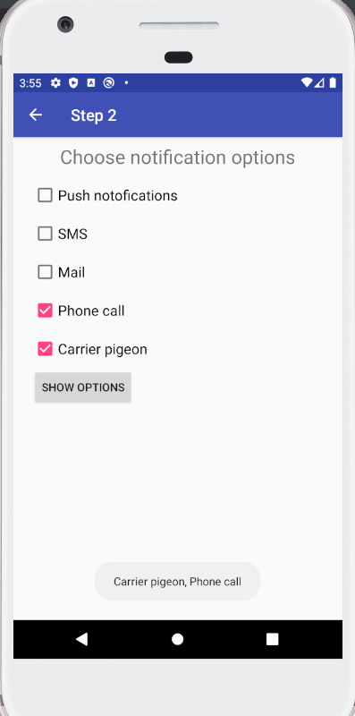

#### Федеральное агентство железнодорожного транспорта
#### Омский государственный университет путей сообщения (ОмГУПС)
#### Кафедра «Автоматика и системы управления»

## СОВРЕМЕННОЕ ПРОГРАММИРОВАНИЕ
                     
#### Лабораторная работа №3 
#### «Взаимодействие с пользователем»

#####   Студент гр. 26м 
#####   Е.С. Выгонныый 
#####   Руководитель – доцент кафедры АиСУ
#####   Е. А. Альтман 

2020г.
##

#### 1	Разработать приложение DroidCafe 


Рисунок 1 – Отображение дизайна при горизонтальной ориентации экрана


Рисунок 2 – Отображение дизайна при вертикальной ориентации экрана


Рисунок 3 – Отображение на устройстве с горизонтальной ориентацией экрана


Рисунок 4 – Отображение на устройстве с вертикальной ориентацией экрана

#### 2 Создайть приложение с 5 checkboxes и кнопкой «Show Toast»


Рисунок 5 – Отображение дизайна

На активности представленно несколько чекбоксов с различными параметрами, при выборе чекбокса его описание будет выведено после нажатия кнопки ***SHOW OPTIONS*** вместе со всеми выбранными пунктами.


Рисунок 6 – Активность с чекбоксами


Рисунок 7 – демонстрация активности с одним чекбоксом



Рисунок 8 – демонстрация активности с несколькими чекбоксами

Для хранения выбранных чекбоксов используется `ArrayList<CheckBox> checkBoxArray`.
Метод `void checkedCheckBox(View view)` вызывается каждый рах когда чекбокс генерирует событие нажатия.
Метод `void showCheckBoxes(View view)` вызывается принажатии на кноапку *SHOW OPTIONS*.

Полный код`CheckBoxActivity` с пояснениями приведен далее.

```java
package com.example.android.droidcafeinput;

import android.support.v7.app.AppCompatActivity;
import android.os.Bundle;
import android.view.View;
import android.widget.CheckBox;
import android.widget.TextView;
import android.widget.Toast;

import java.util.ArrayList;

public class CheckBoxActivity extends AppCompatActivity {


    private ArrayList<CheckBox> checkBoxArray;

    @Override
    protected void onCreate(Bundle savedInstanceState) {
        super.onCreate(savedInstanceState);
        setContentView(R.layout.activity_check_box);

        checkBoxArray = new ArrayList<CheckBox>();      // 
    }


    public void displayToast(String message) {
        Toast.makeText(getApplicationContext(), message,
                Toast.LENGTH_SHORT).show();
    }

    public void checkedCheckBox(View view) {
        CheckBox checkBox = (CheckBox) view;
        if (checkBox.isChecked()) {             // В зависимости от состояния чекбокса
            checkBoxArray.add(checkBox);        // происходит его добавление в массив
        } else checkBoxArray.remove(checkBox);  // или удаление
    }

    public void showCheckBoxes(View view) {
        String message = (String) checkBoxArray.stream()    // сборка сообщения
                .map(TextView::getText)     
                .reduce((s1, s2) -> s1 + ", " + s2)
                .orElse("");
        if (!message.isEmpty())     
            displayToast(message);  // вывод сообщения 
    }
}
```


#### 3	Доработать приложение DroidCafeOptions: добавить кнопку «Дата» под вариантами доставки, которая показывает выбор даты; добавить выбранную пользователем дату во всплывающем сообщении

Пра нажатии кнопки ***CHOOSE DELIVERY DATE*** появится окно с календарем. После выбора и подтверждения дата будет выведена на экран. 


Рисунок 9 – демонстрация работы с датой

Для вызова окна выбора даты можно использовать обычную кнопку.

```xml
   <Button
        android:id="@+id/date_picker_btn"
        android:layout_width="wrap_content"
        android:layout_height="wrap_content"
        android:layout_marginStart="24dp"
        android:layout_marginTop="32dp"
        android:onClick="showDatePicker"
        android:text="@string/choose_delivery_date"
        app:layout_constraintStart_toStartOf="parent"
        app:layout_constraintTop_toBottomOf="@+id/radioGroup" />
```

При вызове данного метода создается экземпляр класса `DatePickerFragment` который используется для работы DataPicker.

```java
    public void showDatePicker(View view) {
        DialogFragment newFragment = new DatePickerFragment();
        newFragment.show(getSupportFragmentManager(), getString(R.string.datepicker));
    }
```

`DatePickerFragment` это класс содержащий логику работы с  нашего приложения с *DatePicker*.
Для корректно работы данный класс наследует `DialogFragment`, для доступа к обработчику реализуется
 метод из интерфейса `OnDateSetListener`.
 
 При вызове `onCreateDialog` создается экземпляр `DatePickerDialog` с текуущей датой.
 Когда пользователь завершил выбор, происходит вызове `onDateSet` где мы исходя из родительской активности вызываем
 обработчик `processDatePickerResult`.

```java
public class DatePickerFragment extends DialogFragment implements DatePickerDialog.OnDateSetListener {

    @NonNull
    @Override
    public Dialog onCreateDialog(Bundle savedInstanceState) {
        final Calendar c = Calendar.getInstance();
        int year = c.get(Calendar.YEAR);
        int month = c.get(Calendar.MONTH);
        int day = c.get(Calendar.DAY_OF_MONTH);

        return new DatePickerDialog(getActivity(), this, year, month, day);
    }

    @Override
    public void onDateSet(DatePicker datePicker, int year, int month, int day) {
        FragmentActivity activity = getActivity();

        if (activity instanceof StatusActivity) {
            StatusActivity statusActivity = (StatusActivity) activity;
            statusActivity.processDatePickerResult(year, month, day);
        }else if(activity instanceof OrderActivity) {
            OrderActivity orderActivity = (OrderActivity) activity;
            orderActivity.processDatePickerResult(year, month, day);
        }
    }
}
```
    
При вызове `processDatePickerResult` происходит обработка данных и вывод пользователю   

```java
    public void processDatePickerResult(int year, int month, int day) {
        String month_string = Integer.toString(month + 1);
        String day_string = Integer.toString(day);
        String year_string = Integer.toString(year);
        String dateMessage = (month_string + "/" + day_string + "/" + year_string);
        Toast.makeText(this, getString(R.string.date_text) + dateMessage, Toast.LENGTH_SHORT).show();
    }
```

#### 4	Создайть приложение с главной «Activity»  и тремя дочерними «Activity». Каждое «Activity» должно иметь меню параметров и использовать панель инструментов:

Главная «Activity» с контентом позволякт перейти к большей части дочерних «Activity».


С помощью значка «Activity»  на верхней панели или *FAB* в нижней части экрана 
можно перейти к «Activity» оформления заказа.
«Activity» оформления заказа позволяет перейти к «Activity» выбора уведомлений.
Кнопка *Up* позволяе вернуться назад   


С помощью верхней панели можно перейти к «StatusActivity», «FavoritesActivity» и «RecipesActivity».


В «RecipesActivity» отображается список рецептов. 
Каждый элемент списка при нажатии запускается «Activity», которая показывает полный текст рецепта и его изображение.


#### 5	Создать приложение, которое использует RecyclerView для отображения списка рецептов. Каждый элемент списка должен содержать название рецепта с кратким описанием. Когда пользователь нажимает на рецепт (элемент в списке), запускается «Activity», которая показывает полный текст рецепта.

*RecyclerView* является более ресурсоэффективным способом отображения прокручиваемых списков.

Для создания *RecyclerView* нужно добавить в файл вестки тег `android.support.v7.widget.RecyclerView` как 
показано далее в листинге файла *activity_recipes.xml*.

```xml
<?xml version="1.0" encoding="utf-8"?>
<android.support.constraint.ConstraintLayout xmlns:android="http://schemas.android.com/apk/res/android"
    xmlns:app="http://schemas.android.com/apk/res-auto"
    xmlns:tools="http://schemas.android.com/tools"
    android:id="@+id/linearLayout"
    android:layout_width="match_parent"
    android:layout_height="match_parent"
    android:orientation="vertical"
    tools:context=".RecipesActivity" >

    <android.support.v7.widget.RecyclerView
        android:id="@+id/recyclerview"
        android:layout_width="match_parent"
        android:layout_height="match_parent" />

</android.support.constraint.ConstraintLayout>
```


Для его использования необходимо создать шаблон, которй будет использоваться для каждого элемента в списке.
Код шаблона приведен ниже.

Листинг *recipe_item.xml*

```xml
<?xml version="1.0" encoding="utf-8"?>
<LinearLayout xmlns:android="http://schemas.android.com/apk/res/android"
    android:layout_width="match_parent"
    android:layout_height="wrap_content"
    android:orientation="vertical"
    android:padding="6dp">

    <TextView
        android:id="@+id/recipe_item_header"
        style="@style/recipe_item_header_styles" />
    <TextView
        android:id="@+id/recipe_item_content"
        style="@style/recipe_item_content_styles" />

    <View
        android:id="@+id/divider"
        android:layout_width="match_parent"
        android:layout_height="1dp"
        android:background="@color/colorPrimaryDark" />
</LinearLayout>
```

Далее в `RecipesActivity` инициальизируются данные для списка.
 Затем  создается `RecipeListAdapter`, в который передается список с данными. Этот объект позволяет нам управлять данными 
 в и обрабатывать события. В конце в `RecyclerView` необходимо передать наш адаптер `mRecyclerView.setAdapter(mAdapter)`
 и  менеджер `LinearLayoutManager` `mRecyclerView.setLayoutManager(new LinearLayoutManager(this))`.

Листинг *RecipesActivity.java*
```java
public class RecipesActivity extends AppCompatActivity {

    private final LinkedList<Recipe> recipeList = new LinkedList<>();
    private RecyclerView mRecyclerView;
    private RecipeListAdapter mAdapter;

    @Override
    protected void onCreate(Bundle savedInstanceState) {
        super.onCreate(savedInstanceState);
        setContentView(R.layout.activity_recipes);

        String[] headers = getResources().getStringArray(R.array.header_recipes_array);
        String[] contents = getResources().getStringArray(R.array.content_recipes_array);
        String[] shortContents = getResources().getStringArray(R.array.short_content_recipes_array);
        String[] imgs = getResources().getStringArray(R.array.img_recipes_array);

        for (int i = 0; i < headers.length ; i++) {
            recipeList.add(new Recipe(
                    headers[i],
                    shortContents[i],
                    contents[i],
                    imgs[i]));
        }

        mRecyclerView = findViewById(R.id.recyclerview);
        mAdapter = new RecipeListAdapter(this, recipeList);
        mRecyclerView.setAdapter(mAdapter);
        mRecyclerView.setLayoutManager(new LinearLayoutManager(this));
    }
}
```

Для того чтобы  `RecyclerView` мог работать с нашими данными необходимо создать `RecipeListAdapter`.
При создании объекта в `RecyclerView` вызывается `onCreateViewHolder` который связывает с помощью
`LayoutInflater` наши данные элемента из списка с XML и создает `RecipeViewHolder`.

`RecipeViewHolder` это класс который описывает как должен выглядеть и работать элемент списка. В нем хранятся все поля и 
обработчики событий для каждого элемента.
Метод `onBindViewHolder` соединяет наши данные с представлением используя для этого `RecipeViewHolder`.

Листинг *RecipeListAdapter.java*
```java
public class RecipeListAdapter extends RecyclerView.Adapter<RecipeListAdapter.RecipeViewHolder> {
    private final LinkedList<Recipe> mRecipesList;
    private LayoutInflater mInflater;
    private Context context;

    public RecipeListAdapter(Context context, LinkedList<Recipe> mRecipesList) {
        this.context = context;
        this.mInflater = LayoutInflater.from(context);
        this.mRecipesList = mRecipesList;
    }

    @NonNull
    @Override
    public RecipeViewHolder onCreateViewHolder(@NonNull ViewGroup parent, int viewType) {
        View mItemView = mInflater.inflate(R.layout.recipe_item, parent, false);
        return new RecipeViewHolder(mItemView, this);
    }

    @Override
    public void onBindViewHolder(@NonNull RecipeViewHolder holder, int position) {
        Recipe recipe = mRecipesList.get(position);
        holder.recipeHeaderTextView.setText(recipe.getHeader());
        holder.recipeContentTextView.setText(recipe.getShortContent());
    }

    @Override
    public int getItemCount() {
        return mRecipesList.size();
    }

    class RecipeViewHolder extends RecyclerView.ViewHolder implements View.OnClickListener {
        public final TextView recipeHeaderTextView;
        public final TextView recipeContentTextView;
        final RecipeListAdapter mAdapter;
        
        public RecipeViewHolder(@NonNull View itemView, RecipeListAdapter adapter) {
            super(itemView);
            this.mAdapter = adapter;
            itemView.setOnClickListener(this);
            recipeHeaderTextView = itemView.findViewById(R.id.recipe_item_header);
            recipeContentTextView = itemView.findViewById(R.id.recipe_item_content);
        }

        @Override
        public void onClick(View v) {       // Обработчик нажатия создает Activity и передает в него данные
            final int position = getAdapterPosition();
            Intent intent = new Intent(v.getContext(), RecipeItemActivity.class);
            intent.putExtra(Recipe.class.getSimpleName() , mRecipesList.get(position));
            context.startActivity(intent);
        }
    }
}
```

Листинг *Recipe.java*

```java
public class Recipe implements Serializable {

    private String header;
    private String shortContent;
    private String content;
    private String img;
...
}
```

При переходе к рецепту в `Activity` передается рецепт, данные из которого используються для заполнения полей.

*RecipeItemActivity.java*

```java
public class RecipeItemActivity extends AppCompatActivity {

    @Override
    protected void onCreate(Bundle savedInstanceState) {
        super.onCreate(savedInstanceState);
        setContentView(R.layout.activity_recipe_item);

        TextView header = findViewById(R.id.recipe_header);
        ImageView imageView = findViewById(R.id.recipe_img);
        TextView content = findViewById(R.id.recipe_content);

        Bundle arguments = getIntent().getExtras();
        final Recipe recipe;
        if (arguments != null) {
            recipe = (Recipe) arguments.getSerializable(Recipe.class.getSimpleName());
            header.setText(recipe.getHeader());
            content.setText(recipe.getContent());
            setImage(imageView, recipe.getImg());
        }
    }

    void setImage(ImageView imageView, String ID) {
        String[] imgs = getResources().getStringArray(R.array.img_recipes_array);
            if (ID.equals(imgs[0])) {
                imageView.setImageResource(R.drawable.dessert_crepes);
            }
            if (ID.equals(imgs[1])) {
                imageView.setImageResource(R.drawable.cake_balls);
            }
            if (ID.equals(imgs[2])) {
                imageView.setImageResource(R.drawable.battenburg_cake);
            }
            if (ID.equals(imgs[3])) {
                imageView.setImageResource(R.drawable.chocolate_covered_oreos);
            }
            if (ID.equals(imgs[4])) {
                imageView.setImageResource(R.drawable.delish_oreo_truffles);
            }
            if (ID.equals(imgs[5])) {
                imageView.setImageResource(R.drawable.ice_cream_sandwiches);
            }
            if (ID.equals(imgs[6])) {
                imageView.setImageResource(R.drawable.cake_balls);
            }
    }
}
```


Для описания рецепта используются отдельные элементы TextView и стили.
Стили применяются с помощью атрибута `style` в листинге *recipe_item.xml*.

Стили используемые в проекте хранятся в *styles.xml* в виде тега `<style>`, который содержит
`item` в каждом из которых содержится название и значение определенного стиля. 
Листинг *styles.xml*

```xml
<resources>
    <style name="AppTheme" parent="Theme.AppCompat.Light.DarkActionBar">
        <item name="colorPrimary">@color/colorPrimary</item>
        <item name="colorPrimaryDark">@color/colorPrimaryDark</item>
        <item name="colorAccent">@color/colorAccent</item>
    </style>

    <style name="AppTheme.NoActionBar">
        <item name="windowActionBar">false</item>
        <item name="windowNoTitle">true</item>
    </style>

    <style name="AppTheme.AppBarOverlay"
           parent="ThemeOverlay.AppCompat.Dark.ActionBar" />

    <style name="AppTheme.PopupOverlay"
           parent="ThemeOverlay.AppCompat.Light" />

    <style name="recipe_item_header_styles">
        <item name="android:layout_width">match_parent</item>
        <item name="android:layout_height">wrap_content</item>
        <item name="android:textSize">24sp</item>
        <item name="android:textStyle">bold</item>
    </style>

    <style name="recipe_item_content_styles">
        <item name="android:layout_width">match_parent</item>
        <item name="android:layout_height">wrap_content</item>
        <item name="android:textSize">16sp</item>
    </style>
</resources>
```

При нажатии кнопки «Вверх» пользователь возвращается к Activity указанной в `parentActivityName`.
Большая часть активностей использует конопку ***'Up'*** для возрата к `MainActivity`.
Но активность рецепта использует данную кнопку для возрата к списку рецептов `android:parentActivityName=".RecipesActivity"`

Листинг *AndroidManifest.xml*

```xml
<?xml version="1.0" encoding="utf-8"?>
<manifest xmlns:android="http://schemas.android.com/apk/res/android"
    package="com.example.android.droidcafeinput">

    <application
        android:allowBackup="true"
        android:icon="@mipmap/ic_launcher"
        android:label="@string/app_name"
        android:roundIcon="@mipmap/ic_launcher_round"
        android:supportsRtl="true"
        android:theme="@style/AppTheme">
        <activity
        // НАСТРОЙКА НАВИГАЦИИ КНОПКИ «ВВЕРХ» ДЛЯ РЕЦЕПТОВ
            android:name=".RecipeItemActivity"  
            android:label="@string/title_activity_recipes"
            android:parentActivityName=".RecipesActivity">
            <meta-data
                android:name="android.support.PARENT_ACTIVITY"
                android:value=".MainActivity" />
        </activity>
        <activity
            android:name=".RecipesActivity"
            android:label="@string/title_activity_recipes"
            android:parentActivityName=".MainActivity">
            <meta-data
                android:name="android.support.PARENT_ACTIVITY"
                android:value=".MainActivity" />
        </activity>
        <activity
            android:name=".FavoritesActivity"
            android:label="@string/title_activity_favorite"
            android:parentActivityName=".MainActivity">
            <meta-data
                android:name="android.support.PARENT_ACTIVITY"
                android:value=".MainActivity" />
        </activity>
        <activity
            android:name=".StatusActivity"
            android:label="@string/title_activity_status"
            android:parentActivityName=".MainActivity">
            <meta-data
                android:name="android.support.PARENT_ACTIVITY"
                android:value=".MainActivity" />
        </activity>
        <activity
            android:name=".CheckBoxActivity"
            android:label="@string/title_activity_checkbox"
            android:parentActivityName=".MainActivity">
            <meta-data
                android:name="android.support.PARENT_ACTIVITY"
                android:value=".MainActivity" />
        </activity>
        <activity
            android:name=".MainActivity"
            android:label="@string/app_name"
            android:theme="@style/AppTheme.NoActionBar">
            <intent-filter>
                <action android:name="android.intent.action.MAIN" />

                <category android:name="android.intent.category.LAUNCHER" />
            </intent-filter>
        </activity>
        <activity
            android:name=".OrderActivity"
            android:label="@string/title_activity_order"
            android:parentActivityName=".MainActivity">
            <meta-data
                android:name="android.support.PARENT_ACTIVITY"
                android:value=".MainActivity" />
        </activity>
    </application>

</manifest>
```


