#### Федеральное агентство железнодорожного транспорта
#### Омский государственный университет путей сообщения (ОмГУПС)
#### Кафедра «Автоматика и системы управления»

## СОВРЕМЕННОЕ ПРОГРАММИРОВАНИЕ
                     
#### Лабораторная работа №4
#### «Настройка интерфейса и тестирование приложений»

#####   Студент гр. 26м 
#####   Е.С. Выгонныый 
#####   Руководитель – доцент кафедры АиСУ
#####   Е. А. Альтман 

2020г.
##

#### 1	Создайть приложение с интерфейсом, изображенным на рисунке

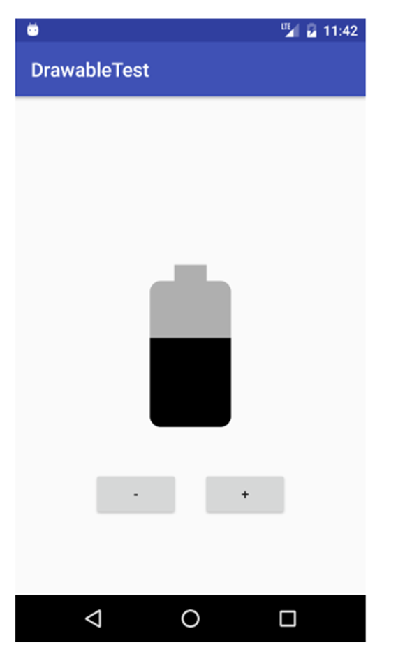

Рисунок 1 – пример приложения

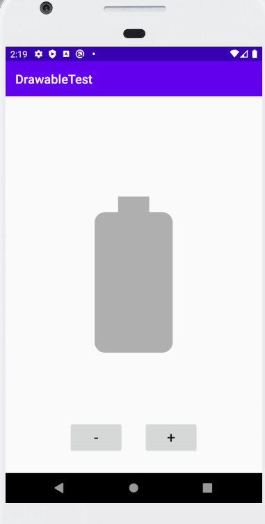

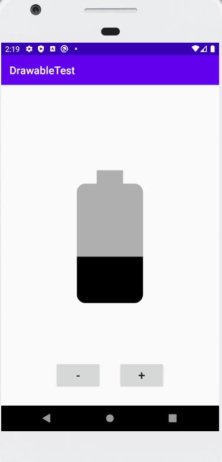
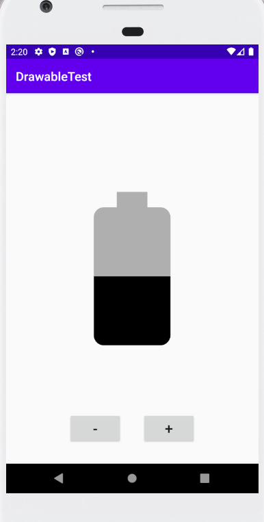
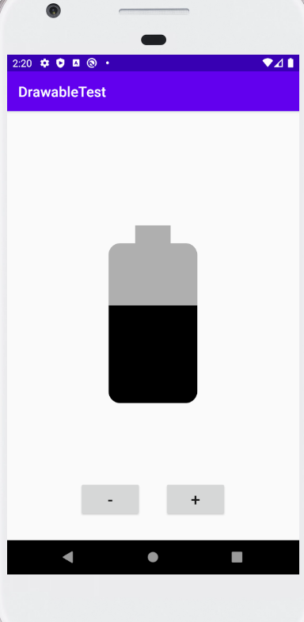
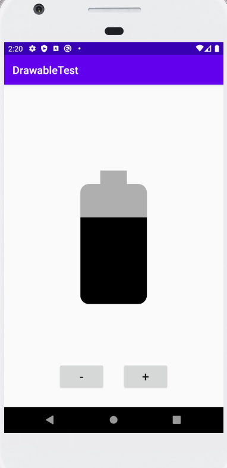
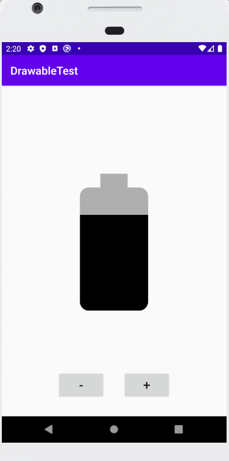
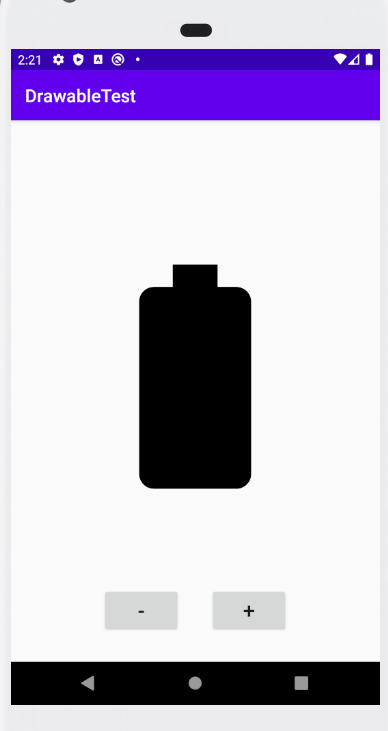

Рисунок 2 – готовое приложения

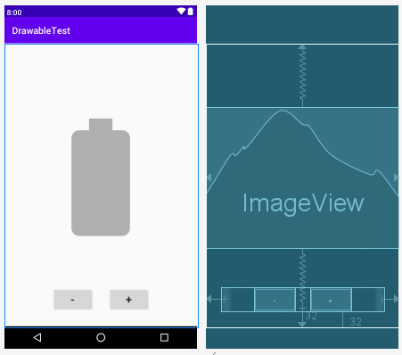

Рисунок 3 – дизайн приложения

Для переключения между изображениями используется *LevelListDrawable*, который позволяет избежать огромных конструкций кода по переключению различных изображений, относящихся к одному объекту. 
Ниже в списке приведены все изображения для каждого шага батареи.

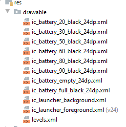

Рисунок 4 – список используемых элементов

В файле *levels.xml* используеться *LevelListDrawable*, который связывает каждое изображение со своим уровнем.  
Для этого используется аттрибут `android:maxLevel="0"`

Листинг *levels.xml*

```xml
<?xml version="1.0" encoding="utf-8"?>
<level-list xmlns:android="http://schemas.android.com/apk/res/android">
    <item
        android:drawable="@drawable/ic_battery_empty_24dp"
        android:maxLevel="0">
    </item>
    <item
        android:drawable="@drawable/ic_battery_20_black_24dp"
        android:maxLevel="1">
    </item>
    <item
        android:drawable="@drawable/ic_battery_30_black_24dp"
        android:maxLevel="2">
    </item>
    <item
        android:drawable="@drawable/ic_battery_50_black_24dp"
        android:maxLevel="3">
    </item>
    <item
        android:drawable="@drawable/ic_battery_60_black_24dp"
        android:maxLevel="4">
    </item>
    <item
        android:drawable="@drawable/ic_battery_80_black_24dp"
        android:maxLevel="5">
    </item>
    <item
        android:drawable="@drawable/ic_battery_90_black_24dp"
        android:maxLevel="6">
    </item>
    <item
        android:drawable="@drawable/ic_battery_full_black_24dp"
        android:maxLevel="7">
    </item>
</level-list>
```

В нашем случае каждое изображение независимо и не содержит какой-либо лишней информации.

Листинг *ic_battery_60_black_24dp.xml*

```xml
<vector android:height="300dp" android:viewportHeight="24.0"
    android:viewportWidth="24.0" android:width="300dp" xmlns:android="http://schemas.android.com/apk/res/android">
    <path android:fillAlpha=".3" android:fillColor="#FF000000" android:pathData="M17,5.33C17,4.6 16.4,4 15.67,4H14V2h-4v2H8.33C7.6,4 7,4.6 7,5.33V11h10V5.33z"/>
    <path android:fillColor="#FF000000" android:pathData="M7,11v9.67C7,21.4 7.6,22 8.33,22h7.33c0.74,0 1.34,-0.6 1.34,-1.33V11H7z"/>
</vector>
```

Для оперирования изображениями используется метод `changePower`, где с помощью `mBatteryIndex`
контролируется уровень изображения. При клике на кнопку `mBatteryIndex` изменяется и устанавливает 
ровень изображения с помощью команды `mBatteryImage.setImageLevel(mBatteryIndex)`.

Листинг *MainActivity.java*

```java
public class MainActivity extends AppCompatActivity {

    private int mBatteryIndex;
    private ImageView mBatteryImage;
    static final String STATE_BATTERY = "state battery";

    @Override
    protected void onCreate(Bundle savedInstanceState) {
        super.onCreate(savedInstanceState);
        setContentView(R.layout.activity_main);

        mBatteryImage = (ImageView) findViewById(R.id.battery);

        if (savedInstanceState != null) {
            mBatteryIndex = savedInstanceState.getInt(STATE_BATTERY);
            mBatteryImage.setImageLevel(mBatteryIndex);
        } else {
            mBatteryIndex = 0;
            mBatteryImage.setImageLevel(mBatteryIndex);
        }
    }

    @Override
    protected void onSaveInstanceState(Bundle outState) {
        outState.putInt(STATE_BATTERY, mBatteryIndex);
        super.onSaveInstanceState(outState);
    }

    public void changePower(View view) {
        switch (view.getId()) {
            case R.id.plus_btn:
                if (mBatteryIndex < 7) {
                    mBatteryIndex++;
                }
                break;
            case R.id.minus_btn:
                if (mBatteryIndex > 0) {
                    mBatteryIndex--;
                }
                break;
        }
        mBatteryImage.setImageLevel(mBatteryIndex);
    }
}
```

#### 2  На основе приложения MaterialMe создайть shared element transition между MainActivity и DetailActivity для демонстрации банера.

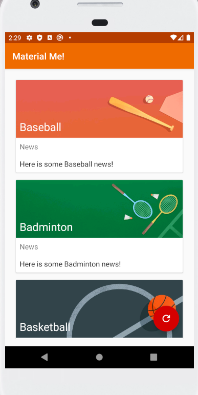
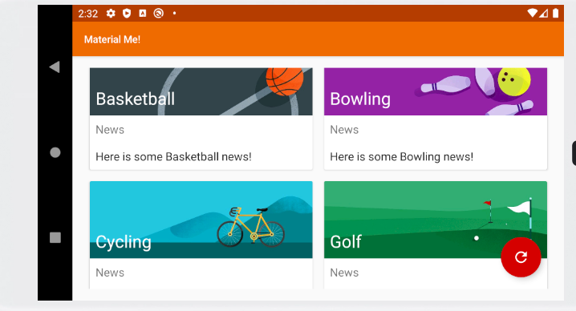
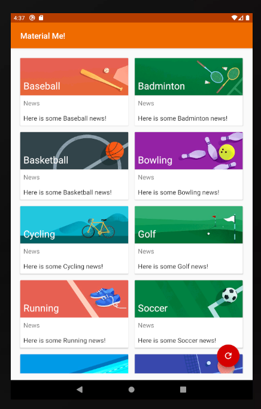
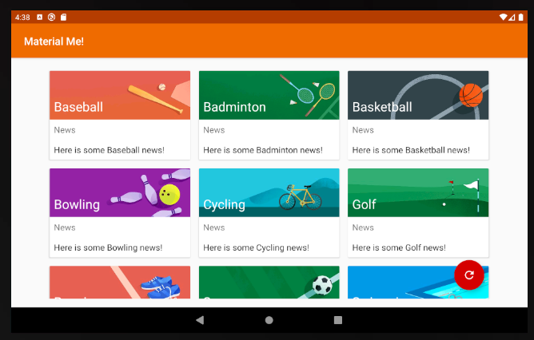
Рисунок 5 – приложение MaterialMe

Рисунок 5 – приложение MaterialMe

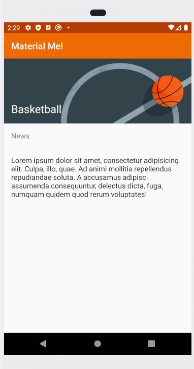

Рисунок 6 – открытая карточка в приложении MaterialMe

Для работы переходов нужно включить их в файле styles.xml с помощью данной команды
`<item name="android:windowContentTransitions">true</item>`

Листинг *styles.xml*

```xml
<resources>
    <style name="AppTheme" parent="Theme.AppCompat.Light.DarkActionBar">
        <item name="colorPrimary">@color/colorPrimary</item>
        <item name="colorPrimaryDark">@color/colorPrimaryDark</item>
        <item name="colorAccent">@color/colorAccent</item>
        <item name="android:windowContentTransitions">true</item>
    </style>
</resources>
```

Затем необходимо привязать анимацию к определенным элементам с помощью аттрибута 
`android:transitionName`. 

Это элемент из карточки списка. С него будет начинатся анимация.

```xml
        <ImageView
            android:id="@+id/sportsImage"
            android:layout_width="match_parent"
            android:layout_height="wrap_content"
            android:adjustViewBounds="true"
            android:transitionName="example_transition" />
```

Это контейнер с описанием. Анимация будет переходить в этот контейнер.

```xml
       <RelativeLayout xmlns:tools="http://schemas.android.com/tools"
               android:layout_width="match_parent"
               android:layout_height="wrap_content"
               tools:context="com.example.android.materialme.DetailActivity"
               android:transitionName="example_transition">
```

Мы можем описать свою кастомную анимацию или использовать готовую анимацию `Fade`.
Она отвечает за плавное анимирование элементов.
Далее необходимо отключить из анимации с помощью команды `excludeTarget` элементы интерфейса.
`fade.excludeTarget(decor.findViewById(R.id.action_bar_container), true);`,
`fade.excludeTarget(android.R.id.statusBarBackground, true);`,
`fade.excludeTarget(android.R.id.navigationBarBackground, true);`.

После данных шагов можно установить нашу анимацию на прямой и обратный переходы с помощью соответствующих команд      
`getWindow().setEnterTransition(fade);
getWindow().setExitTransition(fade);`.

Затем этот же код необходимо добавит в DetailActivity.java, т.к. при переходе настройки анимации сбрасываются 
и элементы отключенные элементы интерфейса начинают обновляться.

Листинг *MainActivity.java*

```java
public class MainActivity extends AppCompatActivity {
    private RecyclerView mRecyclerView;
    private ArrayList<Sport> mSportsData;
    private SportsAdapter mAdapter;

    @Override
    protected void onCreate(Bundle savedInstanceState) {
        super.onCreate(savedInstanceState);
        setContentView(R.layout.activity_main);
        int gridColumnCount = getResources().getInteger(R.integer.grid_column_count);
        mRecyclerView = findViewById(R.id.recyclerView);
        mRecyclerView.setLayoutManager(new GridLayoutManager(this, gridColumnCount));
        mSportsData = new ArrayList<>();
        mAdapter = new SportsAdapter(this, mSportsData);
        mRecyclerView.setAdapter(mAdapter);
        initializeData();

        int swipeDirs;
        if (gridColumnCount > 1) {
            swipeDirs = 0;
        } else {
            swipeDirs = ItemTouchHelper.LEFT | ItemTouchHelper.RIGHT;
        }
        ItemTouchHelper helper = new ItemTouchHelper(new ItemTouchHelper.SimpleCallback(
                ItemTouchHelper.LEFT |
                        ItemTouchHelper.RIGHT |
                        ItemTouchHelper.DOWN |
                        ItemTouchHelper.UP, swipeDirs) {
            @Override
            public boolean onMove(RecyclerView recyclerView, RecyclerView.ViewHolder viewHolder, RecyclerView.ViewHolder target) {
                int from = viewHolder.getAdapterPosition();
                int to = target.getAdapterPosition();
                Collections.swap(mSportsData, from, to);
                mAdapter.notifyItemMoved(from, to);
                return true;
            }
            @Override
            public void onSwiped(RecyclerView.ViewHolder viewHolder, int direction) {
                mSportsData.remove(viewHolder.getAdapterPosition());
                mAdapter.notifyItemRemoved(viewHolder.getAdapterPosition());
            }
        });
        helper.attachToRecyclerView(mRecyclerView);

        Fade fade = new Fade();
        View decor = getWindow().getDecorView();
        fade.excludeTarget(decor.findViewById(R.id.action_bar_container), true);
        fade.excludeTarget(android.R.id.statusBarBackground, true);
        fade.excludeTarget(android.R.id.navigationBarBackground, true);

        getWindow().setEnterTransition(fade);
        getWindow().setExitTransition(fade);
    }

    public void resetSports(View view) {
        initializeData();
    }

    private void initializeData() {
        String[] sportsList = getResources().getStringArray(R.array.sports_titles);
        String[] sportsInfo = getResources().getStringArray(R.array.sports_info);
        TypedArray sportsImageResources = getResources().obtainTypedArray(R.array.sports_images);

        // Clear the existing data (to avoid duplication).
        mSportsData.clear();

        for (int i = 0; i < sportsList.length; i++) {
            mSportsData.add(new Sport(sportsList[i], sportsInfo[i], sportsImageResources.getResourceId(i, 0)));
        }
        sportsImageResources.recycle();

        mAdapter.notifyDataSetChanged();    // Notify the adapter of the change.
    }
}
```

Для запуска анимации перехода используем команду `mContext.startActivity(detailIntent, options.toBundle());` с опциями, которые 
создаются с помощью команды `ActivityOptionsCompat options = ActivityOptionsCompat.makeSceneTransitionAnimation((Activity) mContext, view, mSportsImage.getTransitionName());`.
В ней `makeSceneTransitionAnimation` создает опции и показывает элемент с котрого начинается анимация используя
`mSportsImage.getTransitionName()`.

Листинг *SportsAdapter.java*

```java
class SportsAdapter extends RecyclerView.Adapter<SportsAdapter.ViewHolder>  {
    private ArrayList<Sport> mSportsData;
    private Context mContext;

    SportsAdapter(Context context, ArrayList<Sport> sportsData) {
        this.mSportsData = sportsData;
        this.mContext = context;
    }

    @Override
    public SportsAdapter.ViewHolder onCreateViewHolder(ViewGroup parent, int viewType) {
        return new ViewHolder(LayoutInflater.from(mContext).inflate(R.layout.list_item, parent, false));
    }

    @Override
    public void onBindViewHolder(SportsAdapter.ViewHolder holder,                                 int position) {
        Sport currentSport = mSportsData.get(position);
        holder.bindTo(currentSport);
    }

    @Override
    public int getItemCount() {
        return mSportsData.size();
    }

    class ViewHolder extends RecyclerView.ViewHolder implements View.OnClickListener {
        private TextView mTitleText;
        private TextView mInfoText;
        private ImageView mSportsImage;

        ViewHolder(View itemView) {
            super(itemView);
            mTitleText = itemView.findViewById(R.id.title);
            mInfoText = itemView.findViewById(R.id.subTitle);
            mSportsImage = itemView.findViewById(R.id.sportsImage);
            itemView.setOnClickListener(this);
        }

        void bindTo(Sport currentSport){
            mTitleText.setText(currentSport.getTitle());
            mInfoText.setText(currentSport.getInfo());
            Glide.with(mContext).load(currentSport.getImageResource()).into(mSportsImage);
        }

        @Override
        public void onClick(View view) {
            Sport currentSport = mSportsData.get(getAdapterPosition());
            Intent detailIntent = new Intent(mContext, DetailActivity.class);

            detailIntent.putExtra("title", currentSport.getTitle());
            detailIntent.putExtra("image_resource", currentSport.getImageResource());

            ActivityOptionsCompat options = ActivityOptionsCompat.makeSceneTransitionAnimation((Activity) mContext, view, mSportsImage.getTransitionName());
            mContext.startActivity(detailIntent, options.toBundle());
        }
    }
}
```

#### 3 Модифицировать приложение RecyclerView для вывода списка слов в несколько колонок.
1.	При работе на телефоне: 1 колонка в портретной ориентации и 2 колонки в ландшафтной.
1.	При работе на планшете: 2 колонки в портретной ориентации и 3 колонки в ландшафтной.

Для работы в данных режимах необходимо создать файлы конфигурации для различных позиций и размеров экрана 

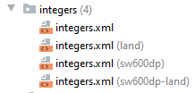

Примертакого файла, где `<integer name="grid_column_count">3</integer>` будет показывать клличество коллонок.

```dtd
<?xml version="1.0" encoding="utf-8"?>
<resources>
    <integer name="grid_column_count">3</integer>
</resources>
```

Для использования необходимо извлеч из ресурсов `int gridColumnCount = getResources().getInteger(R.integer.grid_column_count);`.
Затем необходимо в *RecyclerView* вместо `LinearLayoutManager` передать `GridLayoutManager(this, gridColumnCount)`.

```java
@Override
    protected void onCreate(Bundle savedInstanceState) {
        super.onCreate(savedInstanceState);
        setContentView(R.layout.activity_main);
        Toolbar toolbar = findViewById(R.id.toolbar);
        setSupportActionBar(toolbar);
        FloatingActionButton fab = findViewById(R.id.fab);
        fab.setOnClickListener(new View.OnClickListener() {
            @Override
            public void onClick(View view) {
                int wordListSize = mWordList.size();
                mWordList.addLast("+ Word " + wordListSize);
                mRecyclerView.getAdapter().notifyItemInserted(wordListSize);
                mRecyclerView.smoothScrollToPosition(wordListSize);
            }
        });

        for (int i = 0; i < 20; i++) {
            mWordList.addLast("Word " + i);
        }

        mRecyclerView = findViewById(R.id.recyclerview);
        mAdapter = new WordListAdapter(this, mWordList);
        mRecyclerView.setAdapter(mAdapter);

        int gridColumnCount = getResources().getInteger(R.integer.grid_column_count);

        mRecyclerView.setLayoutManager(new GridLayoutManager(this, gridColumnCount));
        //mRecyclerView.setLayoutManager(new LinearLayoutManager(this));
    }
```

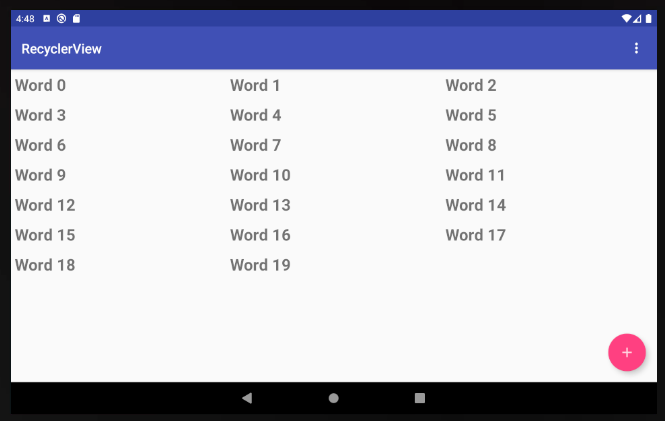
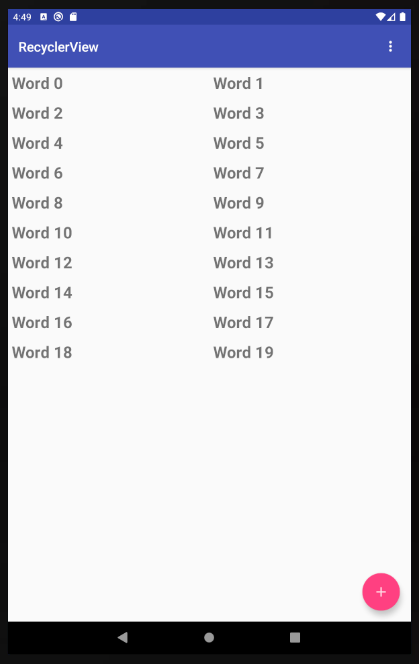
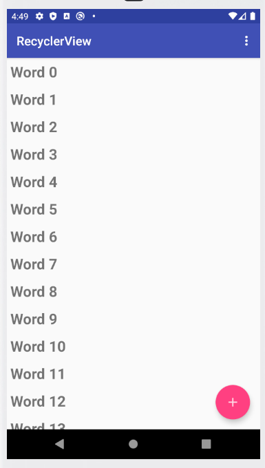

#### 4	Для приложения ScorekeeperEspresso создать тест для проверки Night Mode и Day Mode.

Для создания теста необходимо установить зависимости *Espresso, junit, rules, runner* в *gradle* файле.

```dtd
dependencies {
    implementation fileTree(dir: 'libs', include: ['*.jar'])
    implementation 'androidx.appcompat:appcompat:1.0.2'
    implementation 'androidx.constraintlayout:constraintlayout:1.1.3'
    testImplementation 'junit:junit:4.12'
    androidTestImplementation 'com.android.support.test:rules:1.0.2'
    androidTestImplementation 'com.android.support.test:runner:1.0.2'
    androidTestImplementation 'com.android.support.test.espresso:espresso-core:3.0.2'
}
```

Затем на устройстве или эмуляторе в режиме разработчика следует отключить все анимации, т.к. они влияюь на тесты.

После с помощью команды *Record Espresso test* запустим ультилиту для создания теста.
Результат работы утилиты можно увидеть ниже.

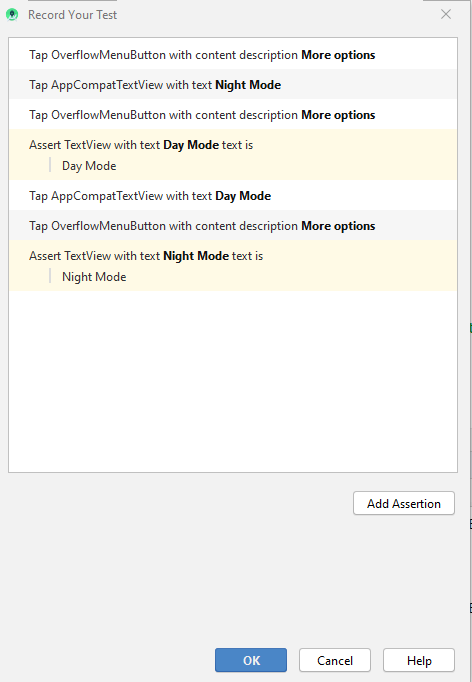

Сгенерированный тест находится в отдельном файле в папке с тестами и может быть запущен со всеми остальными тестами.

Листинг файла *DayNightModeTest.java*

```java
@LargeTest
@RunWith(AndroidJUnit4.class)
public class DayNightModeTest {

    @Rule
    public ActivityTestRule<MainActivity> mActivityTestRule = new ActivityTestRule<>(MainActivity.class);

    @Test
    public void dayNightModeTest() {
        ViewInteraction overflowMenuButton = onView(
                allOf(withContentDescription("More options"),
                        childAtPosition(
                                childAtPosition(
                                        withId(R.id.action_bar),
                                        1),
                                0),
                        isDisplayed()));
        overflowMenuButton.perform(click());

        ViewInteraction appCompatTextView = onView(
                allOf(withId(R.id.title), withText("Night Mode"),
                        childAtPosition(
                                childAtPosition(
                                        withId(R.id.content),
                                        0),
                                0),
                        isDisplayed()));
        appCompatTextView.perform(click());

        ViewInteraction overflowMenuButton2 = onView(
                allOf(withContentDescription("More options"),
                        childAtPosition(
                                childAtPosition(
                                        withId(R.id.action_bar),
                                        1),
                                0),
                        isDisplayed()));
        overflowMenuButton2.perform(click());

        ViewInteraction textView = onView(
                allOf(withId(R.id.title), withText("Day Mode"),
                        childAtPosition(
                                childAtPosition(
                                        withId(R.id.content),
                                        0),
                                0),
                        isDisplayed()));
        textView.check(matches(withText("Day Mode")));

        ViewInteraction appCompatTextView2 = onView(
                allOf(withId(R.id.title), withText("Day Mode"),
                        childAtPosition(
                                childAtPosition(
                                        withId(R.id.content),
                                        0),
                                0),
                        isDisplayed()));
        appCompatTextView2.perform(click());

        ViewInteraction overflowMenuButton3 = onView(
                allOf(withContentDescription("More options"),
                        childAtPosition(
                                childAtPosition(
                                        withId(R.id.action_bar),
                                        1),
                                0),
                        isDisplayed()));
        overflowMenuButton3.perform(click());

        ViewInteraction textView2 = onView(
                allOf(withId(R.id.title), withText("Night Mode"),
                        childAtPosition(
                                childAtPosition(
                                        withId(R.id.content),
                                        0),
                                0),
                        isDisplayed()));
        textView2.check(matches(withText("Night Mode")));
    }

    private static Matcher<View> childAtPosition(
            final Matcher<View> parentMatcher, final int position) {

        return new TypeSafeMatcher<View>() {
            @Override
            public void describeTo(Description description) {
                description.appendText("Child at position " + position + " in parent ");
                parentMatcher.describeTo(description);
            }

            @Override
            public boolean matchesSafely(View view) {
                ViewParent parent = view.getParent();
                return parent instanceof ViewGroup && parentMatcher.matches(parent)
                        && view.equals(((ViewGroup) parent).getChildAt(position));
            }
        };
    }
}
``` 

Результат запуска теста.

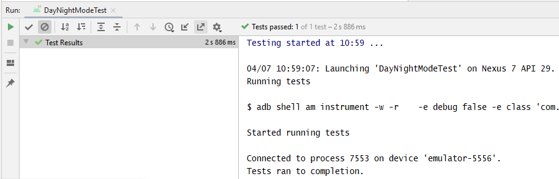
